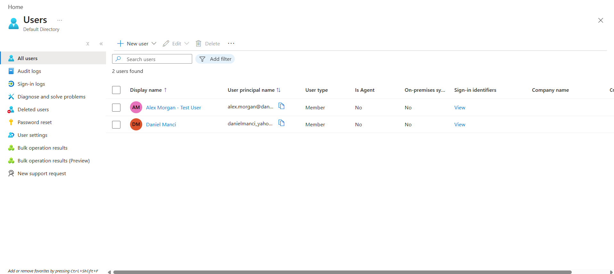
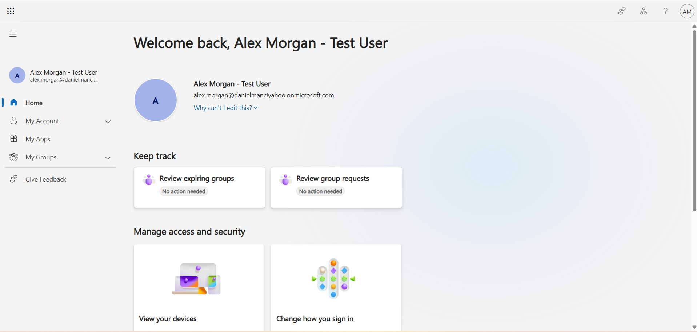
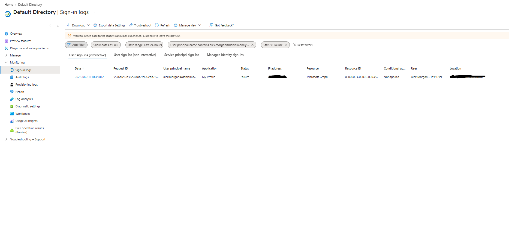
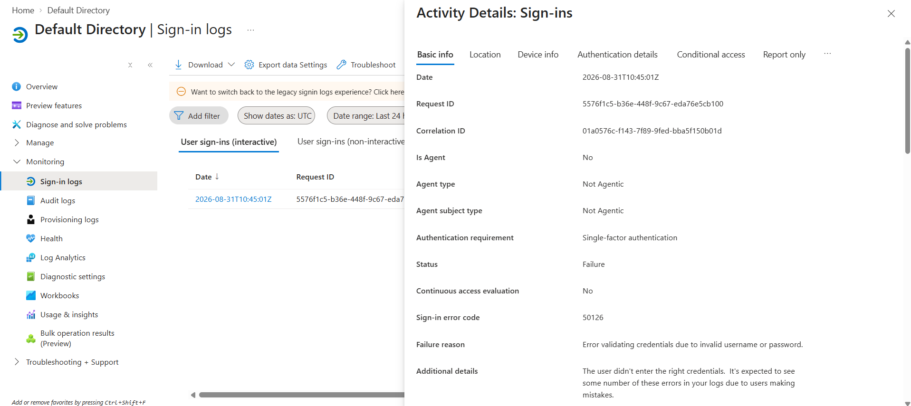
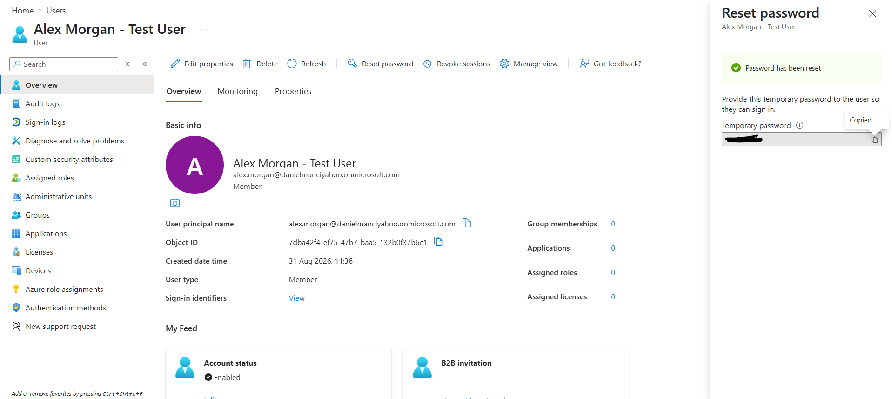
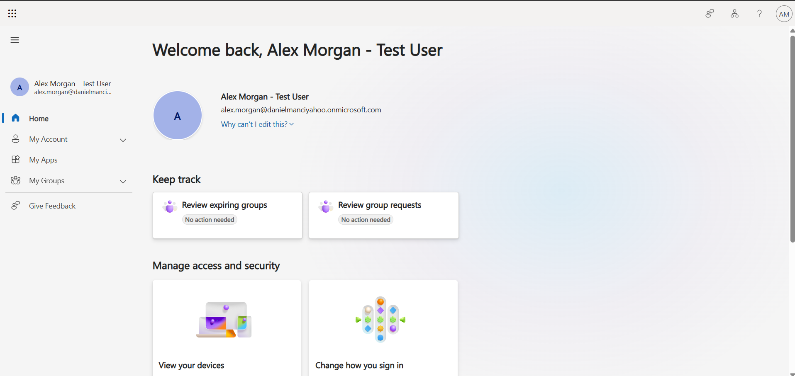

# Microsoft Entra ID Support Lab

A practical Microsoft Entra ID support lab demonstrating cloud user provisioning, first sign-in configuration, password management and authentication troubleshooting in a controlled test environment.

## Lab Objectives

- Create and manage a cloud user in Microsoft Entra ID
- Verify successful first sign-in
- Handle the initial password-change process
- Investigate authentication and sign-in issues
- Review Microsoft Entra sign-in activity
- Document troubleshooting steps and verification

## Environment

- Microsoft Azure
- Microsoft Entra ID
- Microsoft Entra admin centre
- Chrome / Incognito browser sessions
- Test user account: `Alex Morgan - Test User`

## User Provisioning

I created a new Microsoft Entra ID test user named `Alex Morgan - Test User` with a unique User Principal Name within the lab tenant.

The account was enabled and configured with an automatically generated temporary password for the initial sign-in.

## First Sign-In and Password Change

I signed in using the newly created test account in a separate browser session.

Microsoft required the temporary password to be replaced during the first sign-in. After completing the password change, the test user successfully accessed the Microsoft account portal.

This confirmed that the cloud user had been provisioned successfully and could authenticate using the new credentials.

## Authentication Troubleshooting

To simulate a common account-access issue, I deliberately attempted to sign in to the test account using an incorrect password.

I then reviewed the Microsoft Entra ID interactive sign-in logs and filtered the results by the test user's User Principal Name and failed status.

The failed authentication event was identified and inspected in detail.

Microsoft Entra ID reported:

- Status: `Failure`
- Sign-in error code: `50126`
- Failure reason: `Error validating credentials due to invalid username or password`
- Application: `My Profile`

This confirmed that the sign-in issue was caused by invalid credentials rather than an account, application or connectivity problem.

## Administrator Password Reset

To simulate a user who had forgotten their password, I opened the test user's account from the Microsoft Entra ID administrator portal and performed an administrator password reset.

A temporary password was generated for the user, with a password change required during the next sign-in.

No passwords or other authentication credentials are included in the project evidence.

## Access Restoration and Verification

I opened a separate browser session and signed in as the test user using the temporary password.

Microsoft required the user to create a new password before continuing.

After completing the password change, the user successfully accessed the account again.

This confirmed that the administrator password reset restored access successfully.

## Skills Demonstrated

- Microsoft Entra ID user provisioning
- Cloud user account management
- User Principal Name (UPN) configuration
- Temporary password and first-sign-in workflow
- Administrator password resets
- Authentication troubleshooting
- Microsoft Entra sign-in log analysis
- Filtering interactive user sign-ins
- Interpretation of Entra error code `50126`
- Root-cause identification
- Access restoration and verification
- Technical support documentation

## Project Context

This project was completed in a controlled Microsoft Entra ID lab environment using test accounts.

The scenarios were deliberately reproduced to practise common identity and account-support tasks rather than representing incidents handled in a production organisation.
